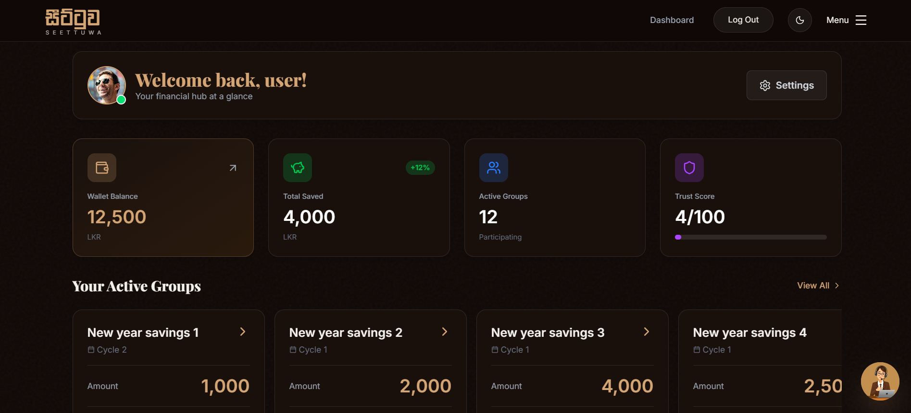
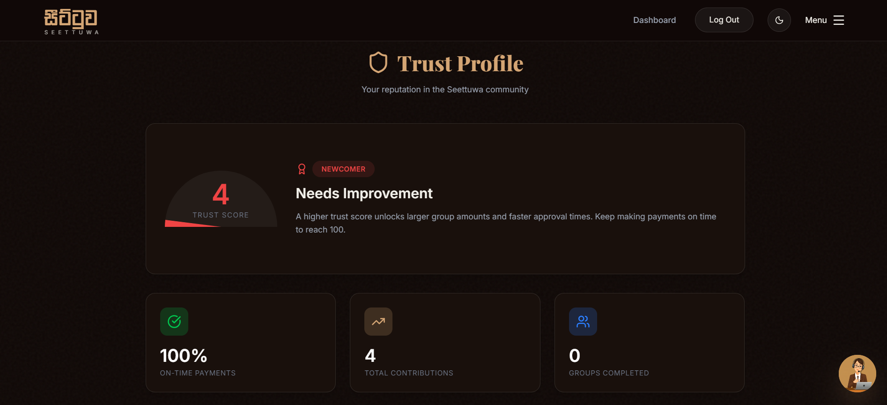
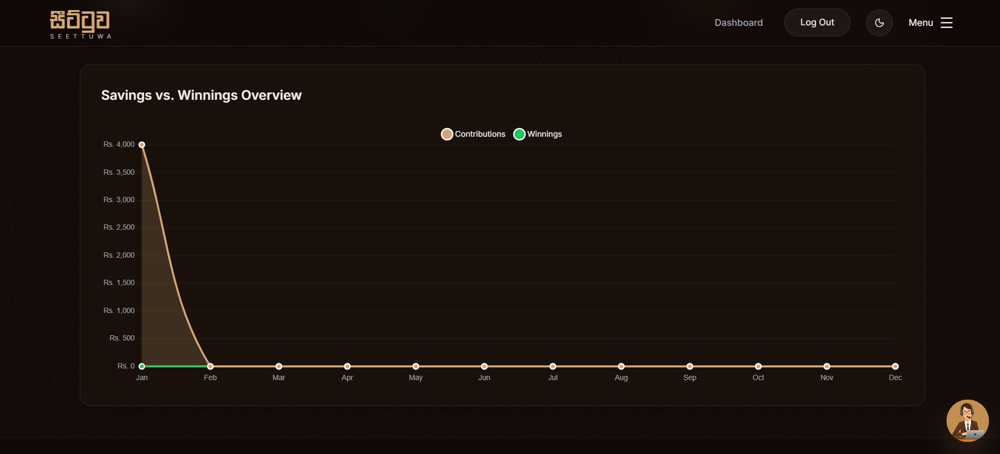
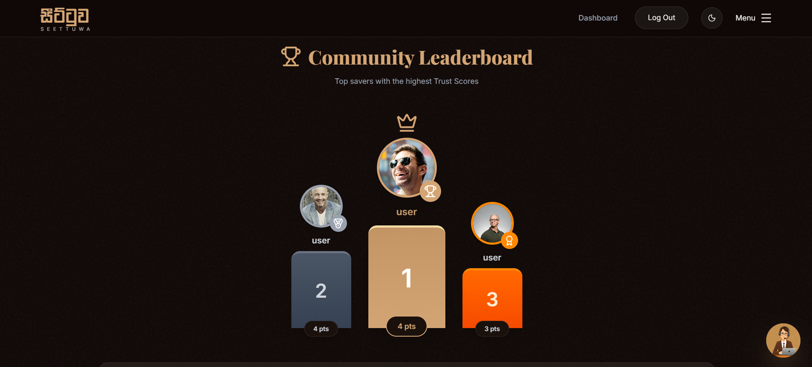

# Seettuwa - Web Client


> *A modern, responsive React application for the Seettuwa Digital ROSCA Platform.*

[](https://reactjs.org/) [](https://www.typescriptlang.org/) [](https://tailwindcss.com/) [](https://vitejs.dev/)

## 📋 Table of Contents
1. [Overview](#-overview)
2. [Visual Tour (Screenshots)](#-visual-tour)
3. [Key Features](#-key-features)
4. [Tech Stack](#-tech-stack)
5. [Getting Started](#-getting-started)
   - [Prerequisites](#prerequisites)
   - [Installation](#installation)
   - [Environment Setup](#environment-setup)
6. [Available Scripts](#-available-scripts)
7. [Contact](#-contact)

---

## 📖 Overview

This is the client-side application for **Seettuwa**, a comprehensive Fintech application designed to digitize the traditional **ROSCA (Rotating Savings and Credit Association)** model. It provides a secure, transparent, and automated digital ecosystem for community savings.

The application connects to the Seettuwa Backend API to offer features like group management, secure payments via Stripe, and real-time lucky draws.

**Live Demo:** [https://seettuwa-app.vercel.app](https://rosca-savings-system-fe.vercel.app/)

---

## 📸 Visual Tour

Experience the interface before diving into the code.

| **User Dashboard** | **Trust Profile** |
|:---:|:---:|
|  |  |
| *Real-time financial overview* | *Reputation score & verification status* |

| **Analytics** | **Leaderboard** |
|:---:|:---:|
|  |  |
| *Financial performance graphs* | *Gamified user ranking* |

> *Note: Screenshots are stored in the `./assets` folder.*

---

## ✨ Key Features

* **Interactive Dashboard:** A comprehensive dashboard that provides a real-time financial overview.
* **Group Management:** Interfaces to create and manage custom savings circles with flexible frequencies.
* **Live Lucky Draw:** A gamified experience featuring a real-time "Spin the Wheel" animation using Framer Motion to select cycle winners.
* **Financial Visualization:** An **Analytics Dashboard** featuring visual graphs showing savings vs. winnings over time.
* **Leaderboard System:** A global ranking system featuring Gold, Silver, and Bronze podiums to gamify savings.
* **Secure Transactions:** Integrated UI for **Stripe** payments and manual bank slip verification uploads.

---

## 🛠️ Tech Stack

This project leverages a modern, performance-oriented stack:

* **Framework:** React.js (Vite)
* **Language:** TypeScript
* **Styling:** Tailwind CSS
* **State Management:** Redux Toolkit & Context API
* **Visuals & Animations:**
    * **Recharts** for financial analytics graphs.
    * **Framer Motion** for the Live Draw animations.
    * **Lucide React** for iconography.
* **HTTP Client:** Axios (Interceptors configured for JWT Auth).

---

## ⚡ Getting Started

Follow these instructions to set up the frontend environment locally.

### Prerequisites
* Node.js (v16 or higher)
* NPM or Yarn package manager.

### Installation

1.  **Navigate to the frontend folder:**
    ```bash
    cd frontend
    ```

2.  **Install dependencies:**
    ```bash
    npm install
    ```
   

### Environment Setup

Create a `.env` file in the root of the `frontend` directory. You must define your API URL and public keys here.

```env
# API Configuration
VITE_API_URL=http://localhost:5000/api/v1

# Stripe Configuration
VITE_STRIPE_PUBLISHABLE_KEY=pk_test_...
``` 

### Running the App

Start the development server:

```Bash
npm run dev
```
> *The application will be available at http://localhost:5173.*

---

## 📜 Available Scripts

| **Command** | **Description** |
|:---:|:---:|
| ```Bash npm run dev ``` | Starts the development server |
| ```npm run build ``` | Builds the app for production to the dist folder |
| ```npm run preview ``` | Locally preview the production build |
| ```npm run lint ``` | Runs ESLint to check code quality. |

---

## 📞 Contact
Developer: [Chamith Bhanuka]

GitHub: [github.com/Chamith-Bhanuka](https://github.com/Chamith-Bhanuka/)

LinkedIn: [linkedin.com/in/chamith-bhanuka](https://linkedin.com/in/chamith-bhanuka)

---

<p align="center"> © 2026 Seettuwa Platform. All Rights Reserved. </p>


